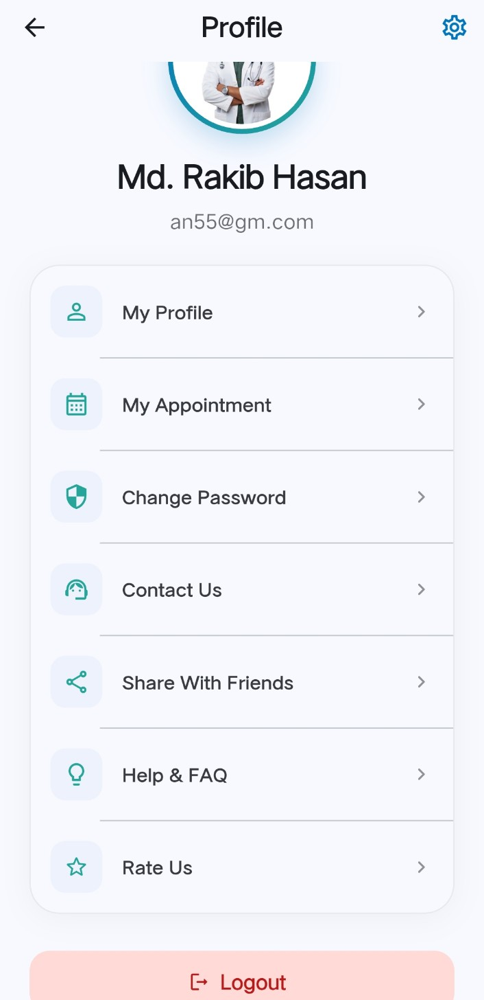
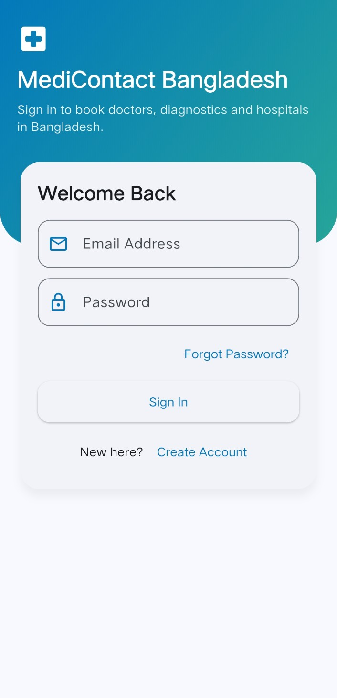
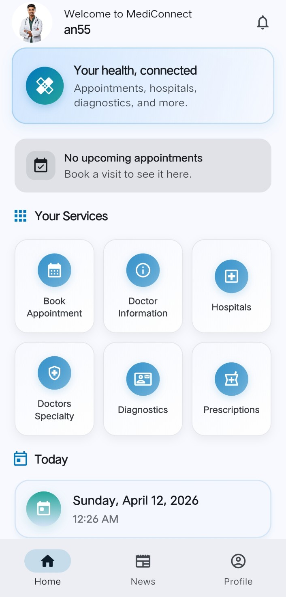
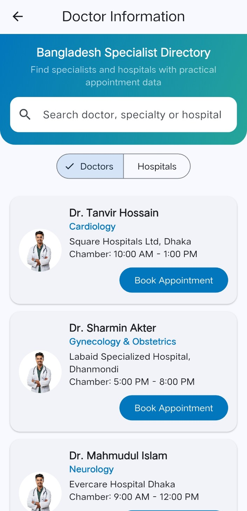
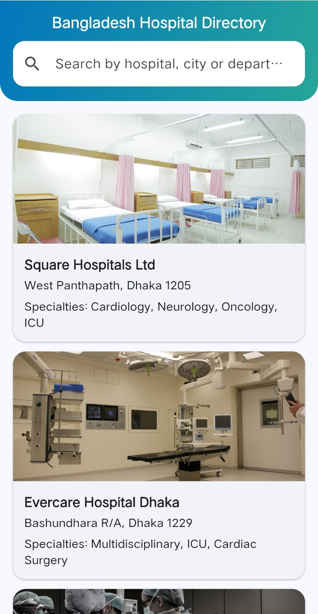
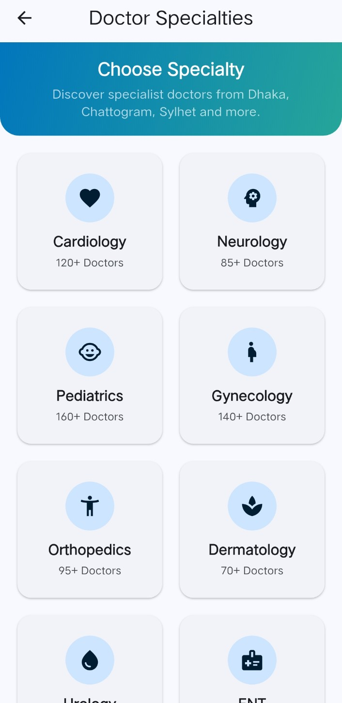
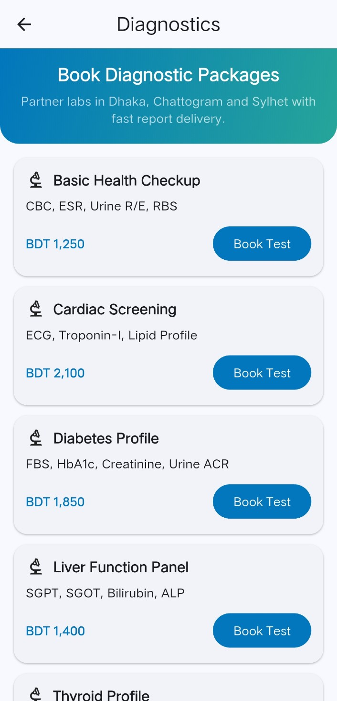
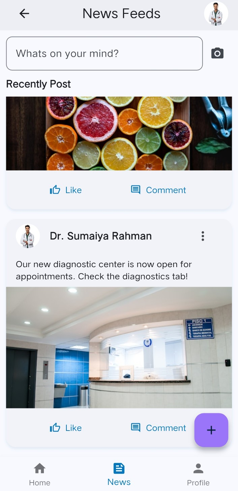

# MediContact Hospital Connect App

MediContact is a Flutter mobile app designed for Bangladesh-focused healthcare access. It provides one place for patients to explore doctors, hospitals, diagnostics, appointment booking, prescriptions, and health-related updates.

## Overview

- Project name: `myapp`
- Platform: Flutter (Android ready)
- Firebase enabled: Yes
- Target audience: Bangladesh users looking for nearby and practical healthcare information

## Core Features

- Authentication
	- User login and registration
	- Firebase Authentication integration
- Home Dashboard
	- Service shortcuts
	- Upcoming appointment summary
	- Personalized header/profile section
- Doctor Information
	- Search doctors by name/specialty/hospital
	- Bangladesh-oriented doctor data
- Hospital Directory
	- Search and browse hospitals
	- Hospital detail page with contact and service information
- Doctor Specialty
	- Visual specialty categories
	- Navigation to doctor information flow
- Diagnostics
	- Diagnostic package list
	- Localized package/test examples with pricing
- Appointment Booking
	- Specialty filter + search
	- Doctor cards with availability and booking action
- News Feed & Profile
	- Health posts feed
	- User profile and settings options

## Tech Stack

- Flutter / Dart (`sdk: ^3.9.0`)
- Material 3 UI
- Firebase Core
- Firebase Authentication
- Cloud Firestore
- `intl` for date/time formatting
- `image_picker`, `table_calendar`, `uuid`


## Prerequisites

Install the following before running:

- Flutter SDK (stable)
- Android Studio (with Android SDK)
- A connected Android device or emulator
- Firebase project configured for Android

Check environment:

```bash
flutter --version
flutter doctor
```

## Setup Instructions

1. Clone repository and open the project folder.
2. Get dependencies:

```bash
flutter pub get
```

3. Ensure Firebase file exists:
	 - `android/app/google-services.json`
4. Confirm FlutterFire options file exists:
	 - `lib/firebase_options.dart`
5. Run app:

```bash
flutter run
```

## Build Commands

- Debug APK:

```bash
flutter build apk --debug
```

- Release APK:

```bash
flutter build apk --release
```

## Firebase Notes

- Firebase plugins are configured in Dart (`firebase_core`, `firebase_auth`, `cloud_firestore`).
- Android Google Services plugin is enabled in:
	- `android/app/build.gradle.kts`
- If you create a new Firebase project, replace:
	- `android/app/google-services.json`
	- regenerate and update `lib/firebase_options.dart`


### Quick fix sequence

```bash
cd android
gradlew --stop
cd ..
flutter clean
flutter pub get
flutter build apk --debug
```

If still locked, close IDE/emulators using the folder, then remove `build/` and `.dart_tool/` folders manually and rebuild.

## Configuration Notes

- Assets are declared in `pubspec.yaml`:
	- `assets/images/`
- Current app identifier in Android:
	- `com.example.myapp`
- Android Gradle contains a OneDrive compatibility workaround for Flutter tasks.

## Future Improvements

- Real backend-driven doctor/hospital datasets
- Full appointment persistence and history
- Push notifications for reminders
- Advanced profile editing and localization (BN/EN)
- Test coverage for UI and service layer

## License

This project is currently private/internal. Add a license file if you plan public distribution.

## App Screenshots

Below is a clean preview gallery of the current app UI.

| Home | Services | News Feed | Profile |
|---|---|---|---|
|  |  |  |  |

| Doctor Information | Hospitals | Diagnostics | Appointment Booking |
|---|---|---|---|
|  |  |  |  |